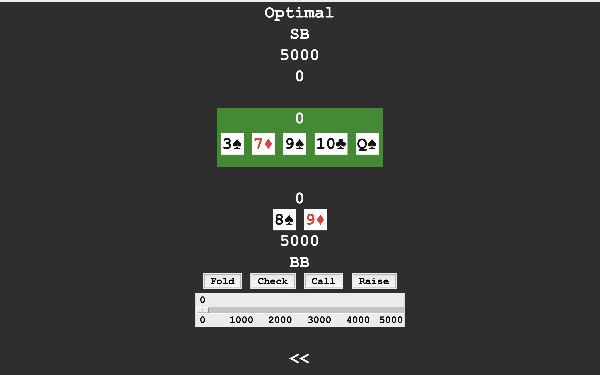
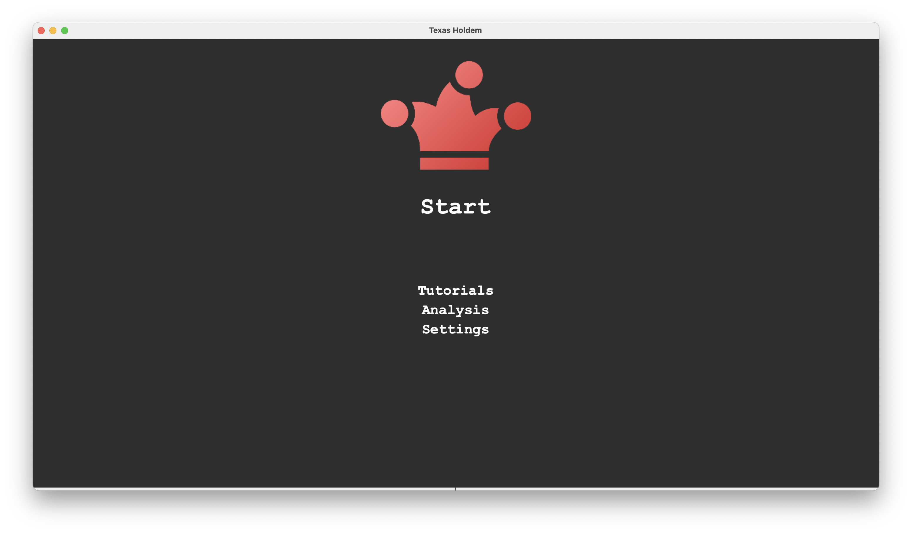
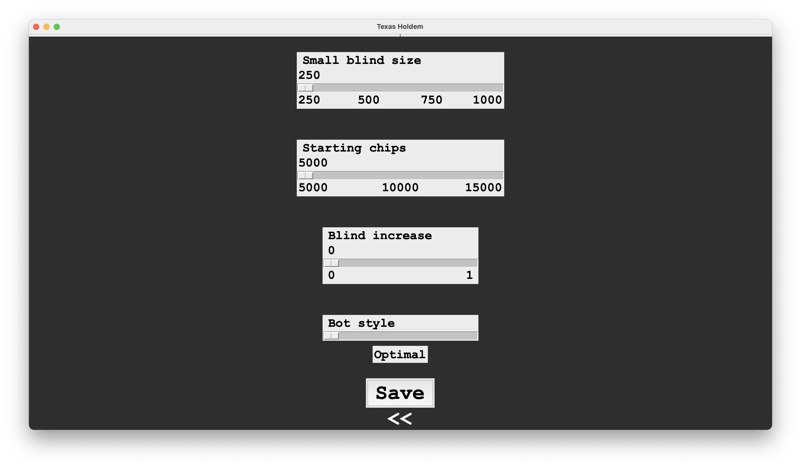
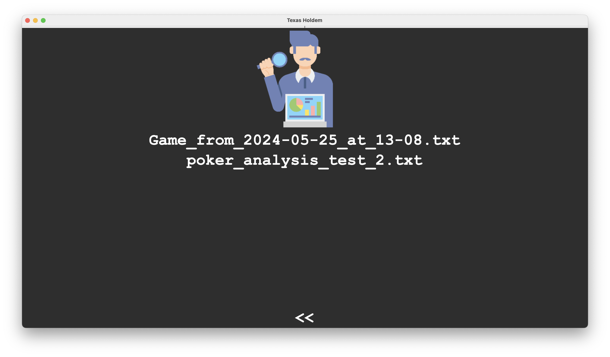
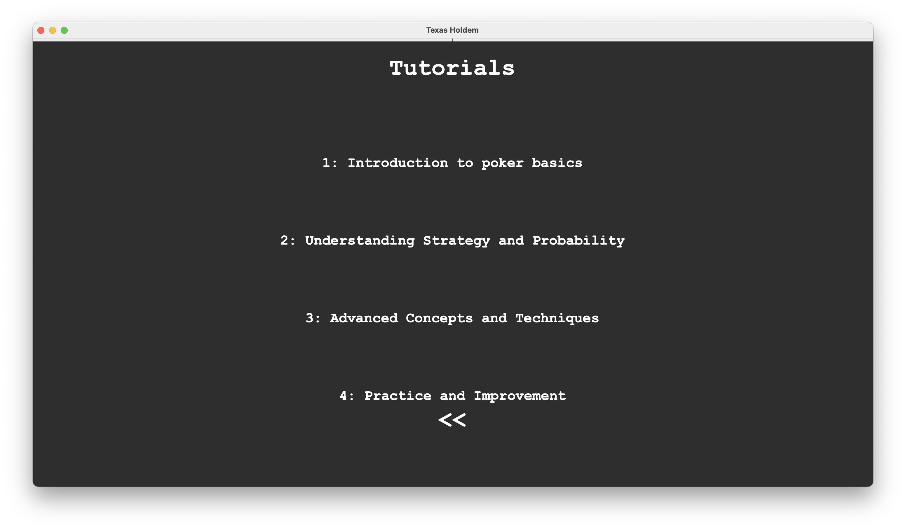

# Poker

## Overview

Thomas is going to write this

## Screenshots

### Start Frame

### Settings

### Analysis Frame

### Tutorials Frame

## Resources

- An Introduction to Counterfactual Regret Minimization by Todd W. Neller & Marc Lanctot  
  [PDF](http://modelai.gettysburg.edu/2013/cfr/cfr.pdf)

- Counterfactual Regret Minimization (AGT 26)  
  [YouTube](https://www.youtube.com/watch?v=ygDt_AumPr0&t=391s)

- Implementing CFR for Kuhn Poker (in Python)  
  [YouTube](https://www.youtube.com/watch?v=NE7V8e77vg4)

- How to build a poker bot (Part 1 Counterfactual Regret minimization)  
  [YouTube](https://www.youtube.com/watch?v=Wa-fRIBGZZI&list=PLoQ2rCmr5jLhPkzClcgRHyz5iLldf-5l3&index=1)

- How to build a poker bot (Part 2 Kuhn Poker)  
  [YouTube](https://www.youtube.com/watch?v=Qz3kSJv_9mE&list=PLoQ2rCmr5jLhPkzClcgRHyz5iLldf-5l3&index=3)

## Attributions
App icon: [Poker chips icons](https://www.flaticon.com/free-icons/poker-chips) created by Freepik - Flaticon
